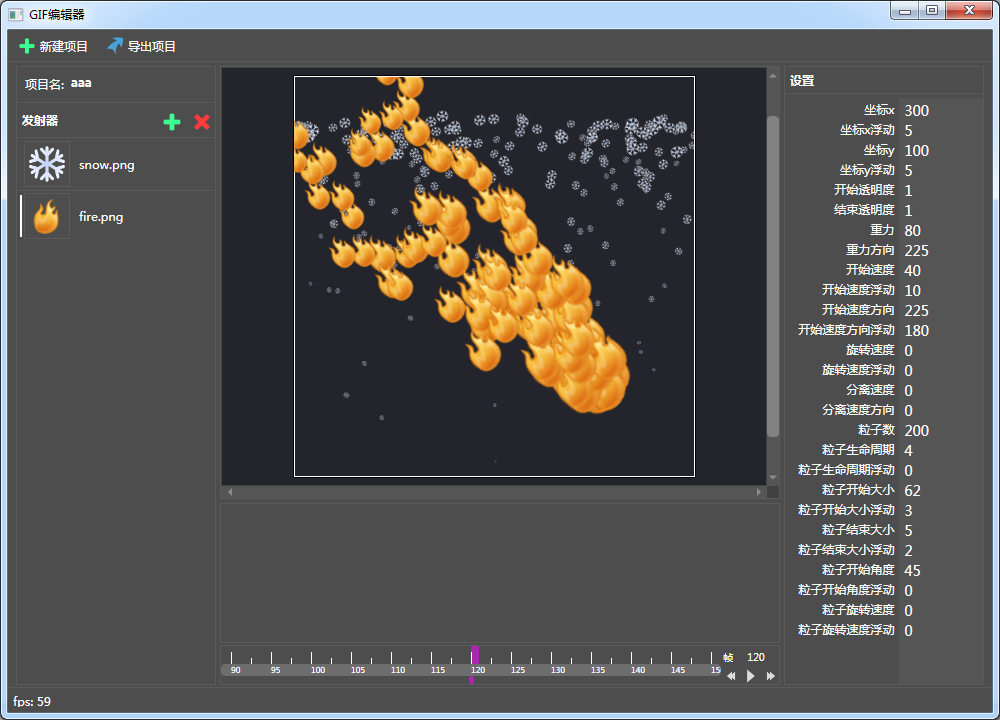

# gifEdit

[https://github.com/xxxxst/gifEdit](https://github.com/xxxxst/gifEdit)

动画粒子编辑器

目前还是半成品，只能导出png(apng)格式

---

## 环境

.net framework 4.6.1 or high

## 编程语言

C# | WPF

---

## 依赖
- OpenGL
- WindowsAPICodePack
- AnimatedGif
- APNGLib
- freeImage

## license

[GPL-3.0 - LICENSE.txt](./LICENSE.txt)
